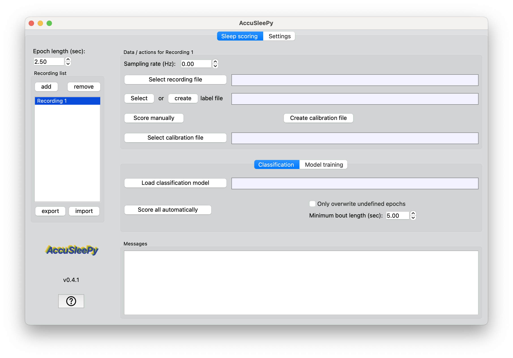
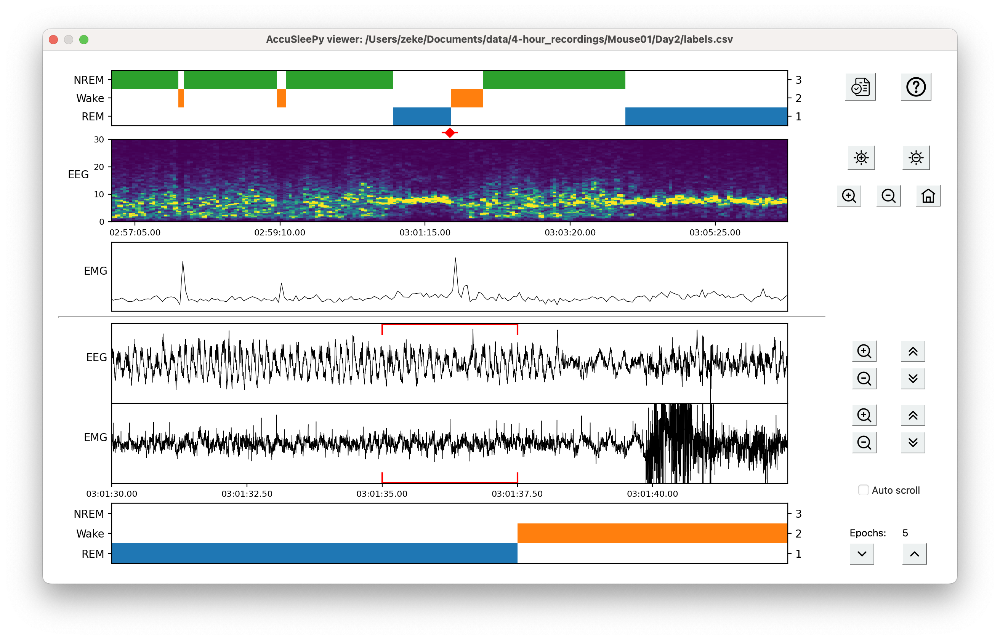

# AccuSleePy

## Description

AccuSleePy is a python implementation of AccuSleep--a set of graphical user interfaces for scoring rodent
sleep using EEG and EMG recordings. It offers several improvements over the original MATLAB version
and is the only version that will be actively maintained.

If you use AccuSleep in your research, please cite our
[publication](https://journals.plos.org/plosone/article?id=10.1371/journal.pone.0224642):

Barger, Z., Frye, C. G., Liu, D., Dan, Y., & Bouchard, K. E. (2019). Robust, automated sleep scoring by a compact neural network with distributional shift correction. *PLOS ONE, 14*(12), 1–18.

The data and models associated with AccuSleep are available at https://osf.io/py5eb/

Please contact zekebarger (at) gmail (dot) com with any questions or comments about the software.

## Installation

- (recommended) create a new virtual environment (using
[venv](https://docs.python.org/3/library/venv.html),
[conda](https://docs.conda.io/projects/conda/en/latest/user-guide/tasks/manage-environments.html),
etc.) using python >=3.10,<3.13
- (optional) if you have a CUDA device and want to speed up model training, [install PyTorch](https://pytorch.org/)
- `pip install accusleepy`
- (optional) download a classification model from https://osf.io/py5eb/ under /python_format/models/

## Usage

`python -m accusleepy` will open the primary interface.

## Screenshots
Primary interface

Manual scoring interface

## Acknowledgements

We would like to thank [Franz Weber](https://www.med.upenn.edu/weberlab/) for creating an
early version of the manual labeling interface.
Jim Bohnslav's [deepethogram](https://github.com/jbohnslav/deepethogram) served as an
incredibly useful reference when reimplementing this project in python.
