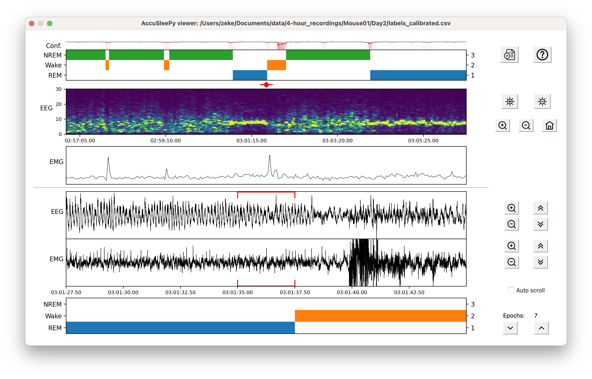

# AccuSleePy

## Description

AccuSleePy is set of graphical user  interfaces for scoring rodent sleep
using EEG and EMG recordings.
It offers the following improvements over the MATLAB version (AccuSleep):

- Up to 10 brain states can be configured through the user interface
- Classification models can be trained through the user interface
    - Model files contain useful metadata (brain state configuration,
      epoch length, number of epochs)
    - Models optimized for real-time scoring can be trained
- Confidence scores can be saved and visualized
- Lists of recordings can be imported and exported for repeatable batch processing
- Undo/redo functionality in the manual scoring interface

If you use AccuSleep in your research, please cite our
[publication](https://journals.plos.org/plosone/article?id=10.1371/journal.pone.0224642):

Barger, Z., Frye, C. G., Liu, D., Dan, Y., & Bouchard, K. E. (2019). Robust, automated sleep scoring by a compact neural network with distributional shift correction. *PLOS ONE, 14*(12), 1–18.

The data and models associated with AccuSleep are available at https://osf.io/py5eb/

Please contact zekebarger (at) gmail (dot) com with any questions or comments about the software.

## Installation

- (recommended) create a new virtual environment (using
[venv](https://docs.python.org/3/library/venv.html),
[conda](https://docs.conda.io/projects/conda/en/latest/user-guide/tasks/manage-environments.html),
etc.) with python >=3.11,<3.14
- (optional) if you have a CUDA device and want to speed up model training, [install PyTorch](https://pytorch.org/)
- `pip install accusleepy`
- (optional) download a classification model from https://osf.io/py5eb/ under /python_format/models/

Note that upgrading or reinstalling the package will overwrite any changes
to the [config file](accusleepy/config.json).

## Usage

`python -m accusleepy` will open the primary interface.

[Guide to the primary interface](accusleepy/gui/text/main_guide.md)

[Guide to the manual scoring interface](accusleepy/gui/text/manual_scoring_guide.md)

## Developer guide
If you want to contribute to the project or modify the code for your own use,
please consult the [developer guide](accusleepy/gui/text/dev_guide.md).

## Changelog

- 0.7.1-0.7.3: Bugfixes, code cleanup
- 0.7.0: More settings can be configured in the UI
- 0.6.0: Confidence scores can now be displayed and saved. Retraining your models is recommended
    since the new calibration feature will make the confidence scores more accurate.
- 0.5.0: Performance improvements
- 0.4.5: Added support for python 3.13, **removed support for python 3.10.**
- 0.4.4: Performance improvements
- 0.4.3: Improved unit tests and user manuals
- 0.4.0: Improved visuals and user manuals
- 0.1.0-0.3.1: Early development versions

## Screenshots

Primary interface

Manual scoring interface

## Acknowledgements

We would like to thank [Franz Weber](https://www.med.upenn.edu/weberlab/) for creating an
early version of the manual labeling interface. The code that
creates spectrograms comes from the
[Prerau lab](https://github.com/preraulab/multitaper_toolbox/blob/master/python/multitaper_spectrogram_python.py)
with only minor modifications.
Jim Bohnslav's [deepethogram](https://github.com/jbohnslav/deepethogram) served as an
incredibly useful reference when reimplementing this project in python.
The model calibration code added in version 0.6.0 comes from Geoff Pleiss'
[temperature scaling repo](https://github.com/gpleiss/temperature_scaling).
