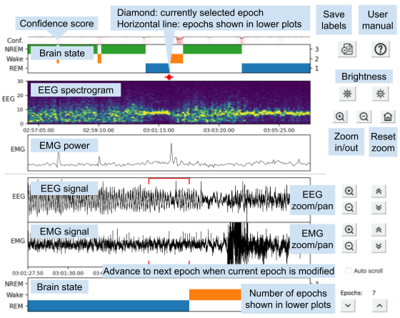

# Manual scoring interface
Mouse actions:
- Upper three plots: click to jump to an epoch, scroll to zoom
- Lower EEG & EMG plots: click + drag to pan, scroll to zoom

Keyboard shortcuts:
- Ctrl + S: save labels to file
- Right / left arrow: move one epoch forward / backward in time
- Numbers 0-9: set current epoch to this brain state
- Backspace: set current epoch to the undefined state
- Shift + (number 0-9, or backspace):
    Press this combination, then click and drag on the upper
    brain state label plot to set selected epochs
    to this brain state. Press Escape to cancel.
- Ctrl + Z: undo last change to brain state labels
- Ctrl + Y: redo last change to brain state labels
- Plus (+): zoom in (upper panel x-axis)
- Minus (-): zoom out (upper panel x-axis)
- Shift + right / left arrow: jump to the next / previous epoch with a different brain state
    than the current epoch
- Space bar: same as shift + right arrow
- Ctrl + right / left arrow: jump to the next / preceding undefined epoch
- Ctrl + W: quit

